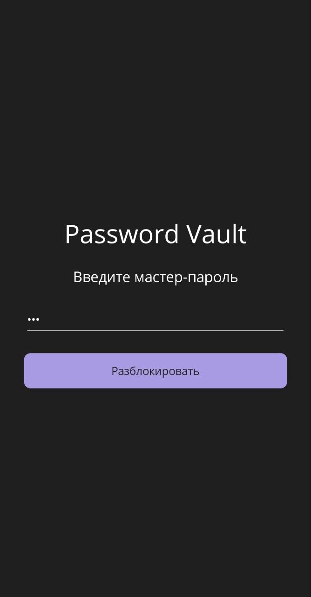
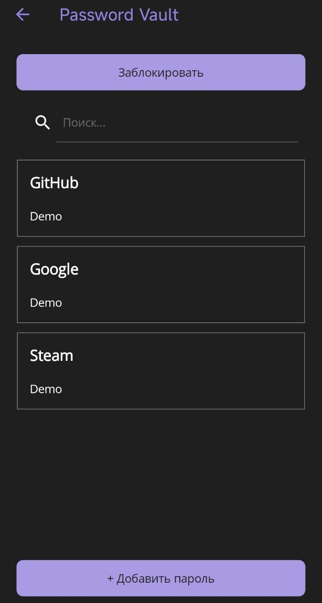
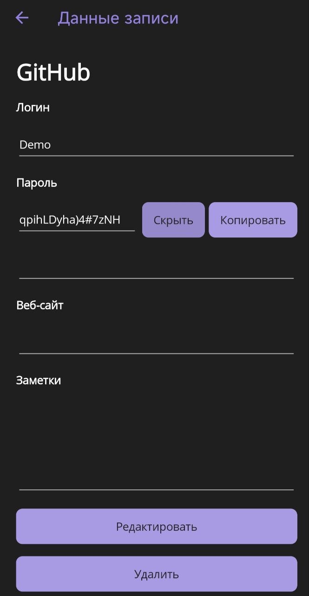
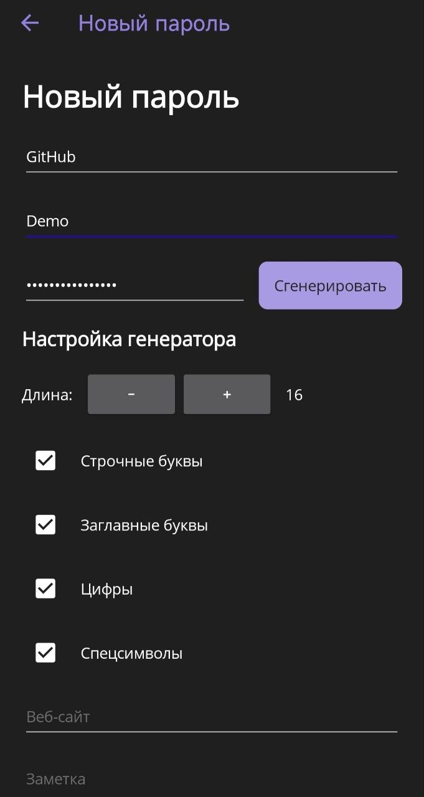

# PasswordVault

**PasswordVault** is a cross-platform password manager built with **C# and .NET MAUI**.

The project focuses on secure local credential storage, encryption, MVVM architecture, database migration, and a clean mobile-oriented user interface.

> **Portfolio / educational project.** PasswordVault is not intended to replace professionally audited password managers.

---

## Features

* Master password protected vault
* AES-GCM encryption
* PBKDF2-based key derivation
* Secure local storage using SQLite
* Add, edit and delete password entries
* Search by title, username and website
* Password generator
* Configurable password generation:

  * Lowercase letters
  * Uppercase letters
  * Digits
  * Special characters
* Password length from **8 to 32 characters**
* Password visibility toggle
* Copy passwords to clipboard
* Snackbar notification after copying
* Vault lock and unlock
* Database migration from the previous schema
* MVVM architecture with `CommunityToolkit.Mvvm`
* Cross-platform .NET MAUI UI
* Tested on Windows and a physical Android device

---

## Security

Security is one of the main focuses of PasswordVault.

The master password is **never stored in the database**.

When the vault is created, a random salt is generated. A 32-byte encryption key is derived from the master password using PBKDF2.

The resulting key is kept in memory only while the vault is unlocked.

### Encryption flow

```text
Master Password
       ↓
PBKDF2 + Salt
       ↓
  32-byte Key
       ↓
    AES-GCM
       ↓
EncryptedData
       ↓
    SQLite
```

### Encrypted data

The following fields are serialized into a single encrypted payload:

* Username
* Password
* Website
* Notes

The database stores password entries using:

```text
Id
Title
EncryptedData
```

The `Title` is stored separately in plaintext so that the application can perform basic searches without decrypting every record.

### Cryptographically secure randomness

PasswordVault uses `System.Security.Cryptography.RandomNumberGenerator` for security-sensitive random values, including:

* PBKDF2 salts
* AES-GCM nonces
* Password generation
* Password character shuffling

When the vault is locked, the encryption key held in memory is cleared.

---

## Architecture

PasswordVault follows an MVVM-based architecture that separates UI, application logic, security and data access.

### Project structure

```text
PasswordVault
│
├── Data
│   └── DatabaseService
│
├── Models
│   ├── PasswordEntry
│   └── VaultMetadata
│
├── Security
│   ├── EncryptionService
│   ├── KeyDerivationService
│   ├── VaultSecurityService
│   └── VaultSetupService
│
├── Services
│   ├── VaultService
│   ├── PasswordGeneratorService
│   └── PasswordDataSerializer
│
├── ViewModels
│   ├── LoginViewModel
│   ├── VaultViewModel
│   ├── AddPasswordViewModel
│   ├── PasswordDetailsViewModel
│   └── EditPasswordViewModel
│
└── Views
    ├── LoginPage
    ├── VaultPage
    ├── AddPasswordPage
    ├── PasswordDetailsPage
    └── EditPasswordPage
```

The main interaction flow is:

```text
View
  ↓
Command
  ↓
ViewModel
  ↓
Service
  ↓
Security / Database
```

This keeps UI logic separate from the application's core functionality and makes the services easier to test independently.

---

## Password Generator

Password generation uses `RandomNumberGenerator` instead of a standard pseudo-random generator.

Users can configure:

* Length: **8–32 characters**
* Lowercase letters
* Uppercase letters
* Digits
* Special characters

At least one character group must be selected.

The generator also guarantees that every selected character group is represented in the resulting password.

For example:

```text
Length: 16

✓ Lowercase
✓ Uppercase
✓ Digits
✗ Special characters
```

The resulting password will contain lowercase letters, uppercase letters and digits, but no special characters.

---

## Database Migration

PasswordVault includes a migration mechanism for the previous `PasswordEntry` schema.

The earlier version of the application stored fields such as:

```text
Username
Password
Website
Notes
```

as separate SQLite columns.

The current schema replaces those fields with:

```text
EncryptedData
```

When an older schema is detected, the application:

1. Renames the legacy table.
2. Creates the new `PasswordEntry` table.
3. Preserves the entry ID and title.
4. Copies the available encrypted data into the new schema.
5. Removes the legacy table.

This allows the database structure to evolve together with the security architecture.

---

## UI

PasswordVault uses a blue and graphite visual style designed around a simple security-product aesthetic.

The interface includes:

* Card-based password entries
* Search
* Password generation controls
* Password visibility controls
* Snackbar feedback
* Consistent forms for adding and editing entries
* Responsive layouts for mobile screens

### Screenshots

#### Login



#### Password Vault



#### Password Details



#### Password Generator



---

## Tech Stack

| Technology                       | Purpose                                          |
| -------------------------------- | ------------------------------------------------ |
| **C#**                           | Application development                          |
| **.NET 10**                      | Runtime and framework                            |
| **.NET MAUI**                    | Cross-platform UI                                |
| **SQLite**                       | Local database                                   |
| **sqlite-net-pcl**               | SQLite integration                               |
| **CommunityToolkit.Mvvm**        | MVVM implementation                              |
| **CommunityToolkit.Maui**        | UI utilities and Snackbar                        |
| **System.Security.Cryptography** | Encryption, key derivation and secure randomness |

---

## Platforms

PasswordVault has been tested on:

* Windows
* Android
* Physical Android device

---

## Project Status

### Completed

* [x] Initial application structure
* [x] SQLite database
* [x] Vault metadata
* [x] Master password setup
* [x] Master password verification
* [x] PBKDF2 key derivation
* [x] AES-GCM encryption and decryption
* [x] Secure in-memory key handling
* [x] Database migration
* [x] Password CRUD operations
* [x] Password search
* [x] Password generator
* [x] Configurable password character groups
* [x] Password length validation
* [x] Password visibility toggle
* [x] Clipboard support
* [x] Snackbar notifications
* [x] MVVM refactoring
* [x] UI/UX redesign
* [x] Android testing
* [x] GitHub documentation

### Next

* [ ] Unit tests for security and core services
* [ ] Additional error handling
* [ ] Further security hardening
* [ ] Release build
* [ ] Android release/package preparation

---

## Future Improvements

Potential future improvements include:

* Unit and integration tests
* Automatic vault locking
* Additional security hardening
* More advanced password generator options
* Improved accessibility
* Additional UI/UX refinements
* Android release build and distribution

---

## Disclaimer

PasswordVault is a **personal portfolio and educational project**.

It is not intended to replace professionally audited password managers for storing highly sensitive real-world credentials.

The project demonstrates practical experience with:

* C# / .NET
* .NET MAUI
* MVVM
* SQLite
* Cryptography
* Secure local storage
* Database migration
* Software architecture
* Cross-platform application development
